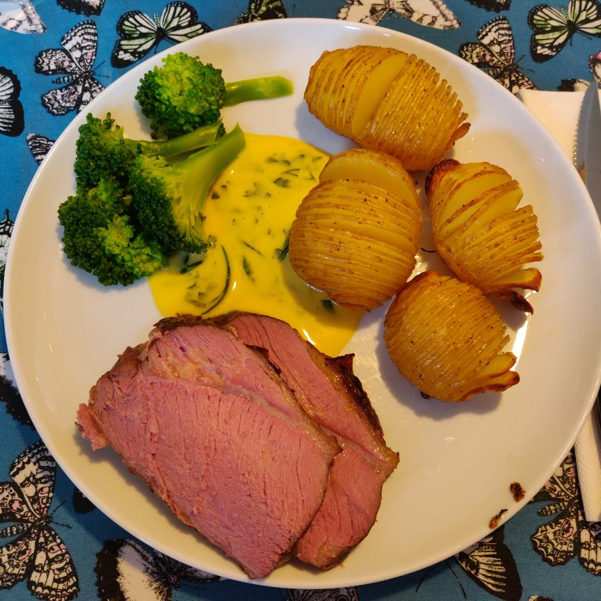

# Bearnaise

## Ingredienser, sovs (4 pers.)
(eller 2 der rigtig godt kan lide bearner)

- 200g smør
- 1 bundt/pakke frisk estragon (kan erstattes med tørret, det bliver *næsten* lige så godt)
- 4 pasteuriserede æggeblommer (vær obs på, at der er 2 blommer i hver beholder)
- bearnaise-essens (fås i næsten alle supermarkeder, nær sovs og bouillon, kan evt. laves hjemmelavet, det er lidt bedre og sejere 💪)

## Ingredienser, essens
- 2 dl hvidvin
- 2 dl hvidvinseddike
- 4 skalotteløg
- hele peberkorn
- laurbærblade

## Fremgangsmåde, essens

1. Bland alle ingredienser i en lille gryde
2. Kog ind til 1/3 væske-volumen
3. Si essensen, og brug en ske til at presse så meget væde ud som muligt

## Fremgangsmåde, sovs

1. Start med at smelte smørret i en lille gryde. Når det er smeltet, holdes det varmt, men ikke simrende (for så bruner det). Jeg bruger indstilling 2-3 ud af 9 på komfuret.
2. Hæld blommer i en anden gryde, sammen med 2 tsk vand
3. Varm blommerne langsomt op under KONSTANT og kraftig omrøring med piskeris, mens du stirrer stift på den. Man kan ikke lavet noget andet imens. Jeg bruger indstilling 4 på komfuret. Så snart du ser det først whiff af damp fra gryden, tager du den af varmen, og bliver ved med at røre. Det er meget nemmere at undgå at sovsen efterfølgende skiller, når æggene bliver varmet op først, men vær forsigtig, for ellers får du røræg. Hvis det begynder at klumpe bare lidt må du starte forfra med nye blommer.
4. Nu er æggene parat til smør, så under konstant omrøring (gryden er stadig ikke på blusset, smørret er jo varmt), røres smørret ind, i en meget tynd stråle. Hvis du gør det langsomt nok bør du aldrig opleve at den skiller, men hvis den gør (pludselig bliver meget tynd), kan du hælde et skvæt kold mælk i, bede en bøn og piske som en sindssyg, så er der gode odds for at redde den. Det hvide bundfald i smør-gryden bør ikke hældes i.
5. Når alt smørret er tilsat, kan det være nødvendigt forsigtigt at varme yderligere op for at få den rette konsistens. Den bør blive ret tyk.
6. Under fortsat omrøring, smager du til med fint salt og essens. Den må godt smage ret kraftigt af essens, men skal selvfølgelig ikke være for salt.
7. Nu justeres konsistensen, ved at tilsætte 1 tsk vand ad gangen, til man synes den har en god konsistens. Her kan det være nødvendigt at få den tilbage på et lavt blus (f.eks. indstilling 3), så den ikke bliver kold, men endelig ikke ved for kraftig varme, for så skiller den. Husk, at sovsen bliver en del tykkere når den køler lidt, så hellere lidt for flydende end lidt for tyk her.
8. Tilsæt en masse frisk eller tørret estragon, f.eks. et helt bundt finthakket frisk estragon, eller 1/3 bøtte tørret. Der må godt være masser af grønne estragon-pletter i sovsen, synes jeg.
9. Hæld sovsen i en sovseskål der har stået med varmt vand, så den ikke er for kold, og server øjeblikkeligt.
