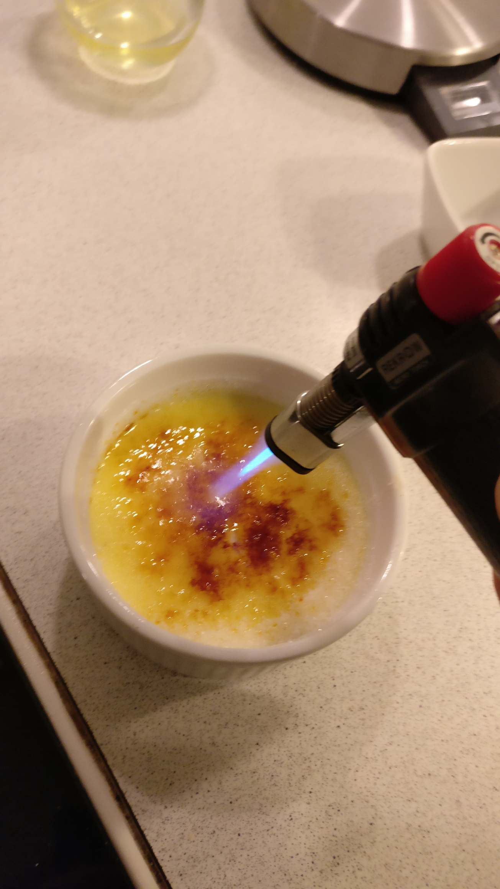

# Creme brulee

## Ingredienser (4 portioner)
- 0.25 l piskefløde
- 1 dl sødmælk
- 0.5 stang vanille
- 75 g sukker
- 1 æg

## Fremgangsmåde
- alt undtagen æg blandes, kommer kort i kog
- køler til 50 c
- pisk æg grundigt i massen
- hæld i forme
- bages i vandbad i 30 min ved 150 c varmuft
- køler i køleskab med folie til helt kold
- drys sukker over og brænd.
