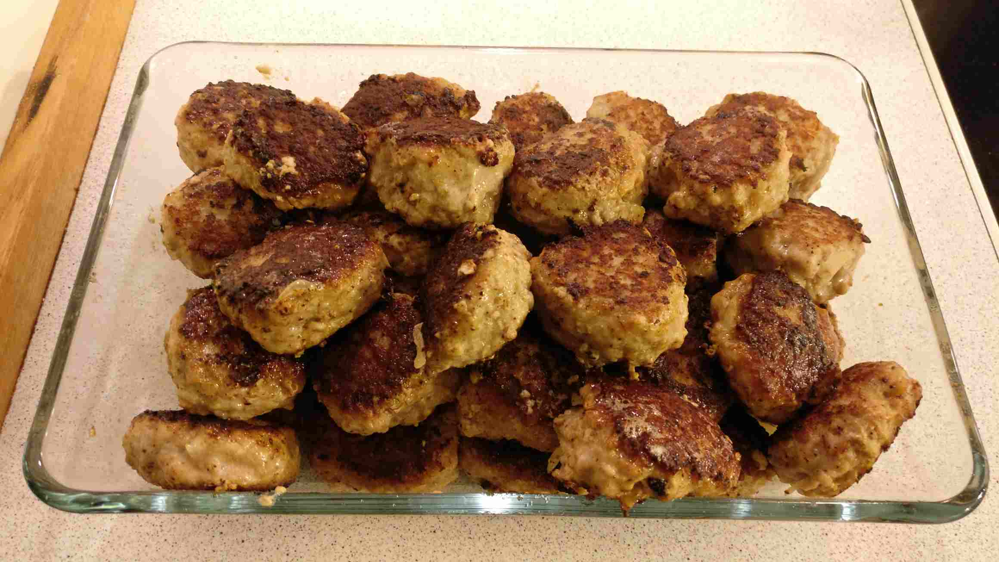

# Frikadeller med brun sovs

## Ingredienser til frikadeller (til 2 pers)
- 500 gram hakket kalv og svine
- 1 mellemstort løg, finthakket
- 1-2 dl mælk
- 2 æg
- 2 spsk mel
- 1/2 spsk salt (kun 1 tsk hvis du bruger suppetern.)
- 1 stort drys peber
- 5 g salt
- muskat

## Ingredienser til sovs
- 2.5 dl vand
- 1 suppetern
- 0.5 dl creme fine
- 1.5 spsk mel
- salt
- peber
- kulør
