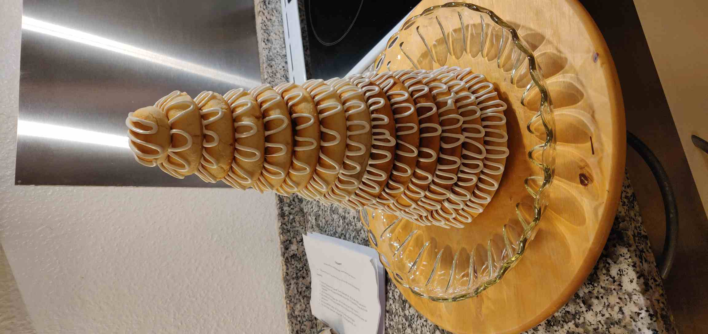

# Kransekage
> Baseret på Mette Blomsterbergs [opskrift](https://www.dr.dk/mad/opskrift/kransekagetop-flot-kransekage-til-nytarsaften)

## Ingredienser (kransekagemasse)

- 1 kg Kranse-XX, revet i små stykker
- 300 g flormelis 
- 80 g pasteuriserede æggehvider 

## Ingredienser (sprøjteglasur)

- 75 g sigtet flormelis 
- 30 g pasteuriserede æggehvider 

## Fremgangsmåde (ringene)
- Bland kranse XX, flormelis og æggehvider med spartel på køkkenmaskine, eller brug hænderne, til det er ensartet.
- Læg massen i plastikpose i køleskab min. 2 timer eller til næste dag.
- Mål 74 cm af på bordpladen og marker med malertape i enderne.
- Del massen op i 5 kugler á 276 g, og rul dem ud til de markerede 74 cm. Sørg for at de bliver så ensartede i tykkelsen som muligt.
- Pres staven ned på den ene side, hele vejen hen, med en håndflade, så tværsnittet får en trekantet form. Staven kan nemt løsnes fra bordpladen ved at vippe den hen mod den trekantede side.
- Form kransekagemassen til ringe á 8, 10, 12 cm osv., eller brug smør-smurte kransekageforme med rasp. Massen bør passe til 13 ringe plus en kugle til toppen.
- Ringene placeres på bageplader i forme eller på bagepapir, og bages gyldne ved 200 C varmluft 14-18 min.

## Fremgangsmåde (samling)
- Til glasuren piskes flormelis og æggehvide så stive, at glasuren ikke flyder sammen igen, og kommes i cornet.
- Ringene sprøjtes og placeres på kagefad én ad gangen.
- lad tørre et par timer og dæk til med husholdningsfilm, så kan den holde nogle dage.

## Tips
- For at få jævne stave, fremfor bulede, bruges håndfladerne mest muligt, eller hold fingrene på skrå når der rulles.
- Hvis staven bliver for lang, kan man "rulle indad" for at forkorte staven.

