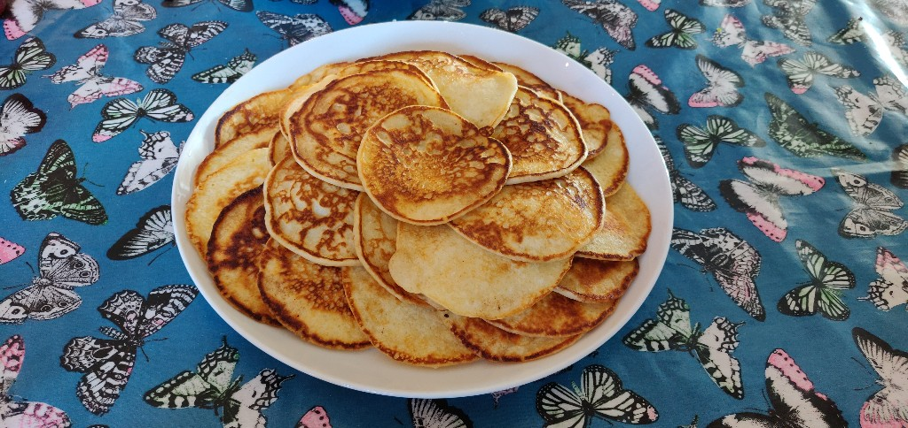

# Pandekager (Amerikanske)

## Ingredienser (til 3 pers., 27 stk.)
- 2 æggehvider
- 2 æggeblommer
- 200 g hvedemel, øko
- 2 tsk sukker 
- 0.5 tsk vanillesukker
- 1 tsk flagesalt 
- 1 tsk bagepulver 
- 390 g minimælk

## Fremgangsmåde (45 min)
1. Hviden piskes med sukre til skålen kan vendes på hovedet, ca. 5 min
2. Bland mel, salt og bagepulver i firkantet skål 
3. Forvarm panden til 8
4. Hæld de piskede hvider over i en glasskål 
5. Pisk mælk og æggeblomme i den tomme metalskål på indstilling 5, tilsæt melblandingen gradvist.
6. Fold æggehviderne ind med dejskraber
7. Med rundbundet sovseske, hæld fire klatter dej på smørsmurt pande, steges lysebrune
8. Vendes 180 grader i pandens plan så snart det er muligt (mens oversiden stadig er halvflydende), og flippes derefter
9. Serveres med ahornsirup og blåbær
