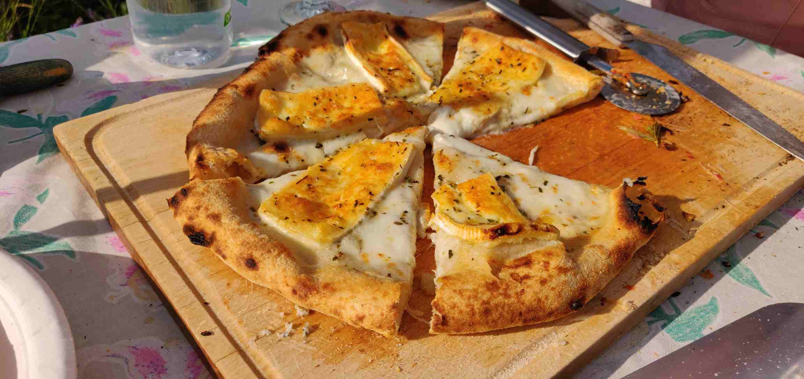

# Pizza

## Dej

### Ingredienser (4 stk.)
- 625 g mel,
- 400 g vand,
- 50 g olivenolie,
- 2 tsk salt,
- 1 tsk tørgær

### Fremgangsmåde
1. Bland alle ingredienser, ælt grundigt til dejen er stærk.
2. Lad hvile tildækket natten over i køleskab (eller brug mere gær, hvis den skal bruges samme dag).
3. Ca. 2 timer før dejens skal bruges, tages den ud af køleskabet og deles i 4. Hver dejklump formes til en kugle og hæver tildækket i smurt beholder.
wip/Pizza.md

## Varianter
Til røde pizzaer bruges ca. 65 g tomatsauce pr. stk.

- Margherita (basilikum)
- Quartro Formaggi (oregano)
- Funghi (timian)
- Kartoffel (rosmarin)
- Pepperoni (oregano)
- Capricciosa (oregano)
- Løg & bacon (oregano)

## Tips
- hvis dejen er lige våd nok, bag 2 min på bagepapur (kun undervarme!), fjern så papiret og skift til over-undervarme
