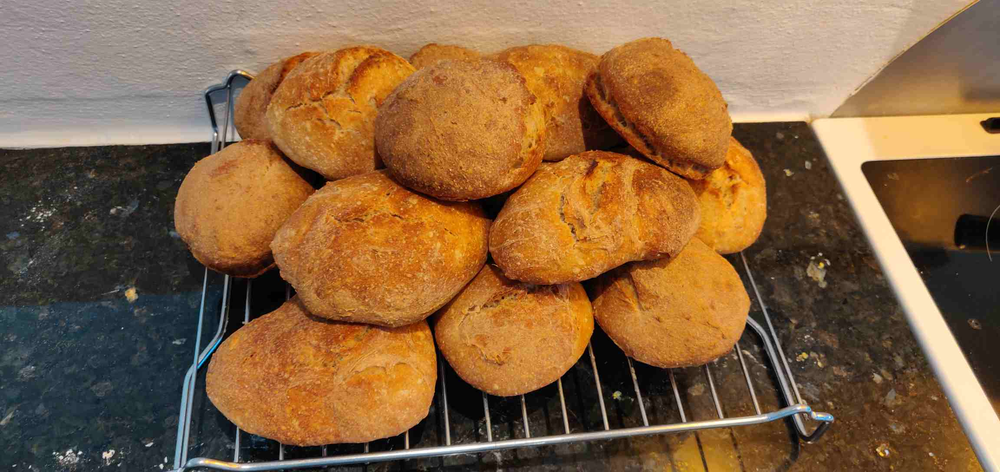

# Surdejsboller

Det er bedst at opbevare surdejen i køleskab, for ellers bør den sådan set fodres dagligt. I køleskab kan den fint trives i 1-2 uger mellem brug eller fodring. Det er så bedst at sætte den i køleskab umiddelbart efter fodring, så den har noget frisk mad at leve af i sit vinterhi.

Det er nemt at fodre: Du kasserer/bortforærer ca. halvdelen (brug evt. en vægt til at veje hvor meget du har fjernet), og hvis du f.eks. fjerner 20 gram, så tilsæt 10 gram hvedemel og 10 gram vand, og rør rundt. Done! Du kan nu lade den leve fredeligt i køleskabet i en uge eller to. Hvis du gerne vil "opformere den" (f.eks. hvis en opskrift kræver mere surdej end du har), kan du efter fodring vente ca. 3 timer til den har fordoblet i volumen, og så fodre den igen, uden dog at kassere, for så får du jo ikke mere end du havde...

Hvis du f.eks. bager boller hver eller hver anden weekend, behøver du dog ikke tænke i at fodre den, for så er fodringen ligesom indbygget i opskriften, som beskrevet her:

Du er klar til at blande dejen, når du har ca. 80 gram surdej, som netop har "peaket", altså fordoblet i volumen. Hvis man venter for længe begynder den at falde sammen igen, og så er hæve-evnen ikke helt lige så god, så prøv at fange den, når den er cirka fordoblet (typisk ca. 3 timer efter fodring). Det kan så være nødvendigt først at fordoble surdejen inden, som beskrevet ovenfor, men fremover kan du bare gemme 40 gram surdej i køleskab, og bare fordoble op én gang, så du har nok til opskriften. 

## Ingredienser (8 stk.)
- 330 gram vand
- 80 gram "peaket" surdej
- 1 tsk honning (eller sukker)
- 410 gram hvedemel
- 135 gram grahamsmel (kan evt. erstattes med hvedemel, men jeg synes de bliver bedst af også at få lidt fuldkorn)
- 7 gram salt

## Fremgangsmåde
1. Bland følgende ingredienser sammen i en skål:
2. Når dejen er blandet, kan du tage noget af den fra (f.eks. 40 gram) og stille i køleskab til næste gang.
3. Selve brøddejen tildækkes derefter med husholdningsfilm, og hæver natten over ved stuetemperatur. Den fordobler cirka i volumen, og udvikler masser af smag undervejs.
4. Dejen halveres indtil man har 8 klumper, som formes til kugler og lægges på bagepapir. Dejen er temmelig klistret, men det skal den være 🙂
5. Tildæk bagepladen, ideelt set ved at sætte en bradepande ovenpå (husholdningsfilm har det med at hænge fast), og lad efterhæve cirka 20 min.
6. Bages ca. 22 minutter ved 230 C varmluft, til de er så mørkebrune som du overhovedet kan få dem, uden at ~~der går ild i dem~~ de bliver sorte, så synes jeg de bliver bedst 😄
7. Tag bollerne af bagepladen og lad køle inden bestialsk fortæring.

Man kan snildt lave en dobbelt portion, og smide de ekstra i fryseren. Så kan man lige defroste dem i mikrobølgeovn, og så er de faktisk næsten som nybagte, hvis de fryses ned samme dag som de bages.
